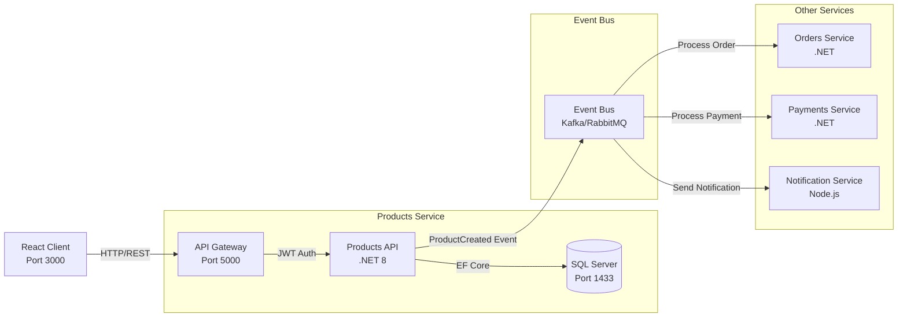

# ZenTek Products API

A .NET 8 Web API for managing products with JWT authentication.

## Features

- **Anonymous Health Check** (`GET /health`)
- **JWT Authentication** (`POST /api/auth/login`)
- **Products CRUD** (secured with JWT)
  - `GET /api/products` - List all products
  - `GET /api/products?colour={colour}` - Filter by colour
  - `POST /api/products` - Create product
- **SQL Server** database with Entity Framework Core
- **Unit Tests** (xUnit with InMemory provider)
- **Integration Tests** (HTTP client tests)
- **React Frontend** with Vite
- **Docker** support

## Getting Started

### Local Development

1. Start SQL Server:
```bash
docker run -e "ACCEPT_EULA=Y" -e "SA_PASSWORD=Password123!" -p 1433:1433 -d mcr.microsoft.com/mssql/server:2022-latest
```

2. Run the API:
```bash
cd src/ZentekProducts.Api
dotnet run
```

3. Run the frontend:
```bash
cd src/ZentekProducts.Client
pnpm install
pnpm dev
```

### Docker Compose

```bash
docker compose up --build
```

- API: http://localhost:5000
- Frontend: http://localhost:3000

### Default Credentials

- Username: `admin`
- Password: `admin123`

## Architecture



## API Endpoints

| Method | Endpoint | Auth | Description |
|--------|----------|------|-------------|
| GET | `/health` | Anonymous | Health check |
| POST | `/api/auth/login` | Anonymous | Get JWT token |
| GET | `/api/products` | JWT | List all products |
| GET | `/api/products?colour={col}` | JWT | Filter by colour |
| POST | `/api/products` | JWT | Create product |

## Project Structure

```
zentek/
├── src/
│   ├── ZentekProducts.Api/      # .NET 8 Web API
│   │   ├── Controllers/
│   │   ├── Models/
│   │   ├── Services/
│   │   └── Data/
│   └── ZentekProducts.Client/  # React + Vite
├── tests/
│   ├── ZentekProducts.Tests/           # Unit tests
│   └── ZentekProducts.IntegrationTests/  # Integration tests
├── docker-compose.yml
└── README.md
```